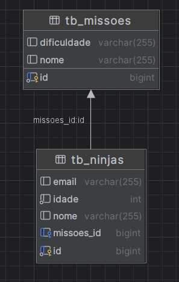
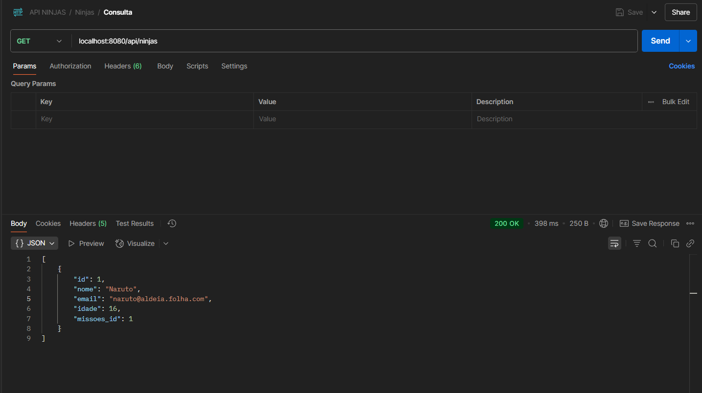
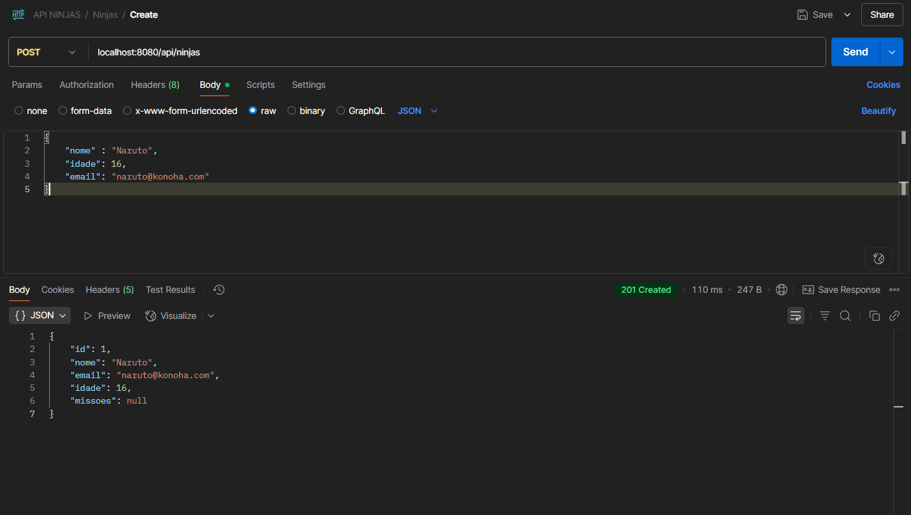
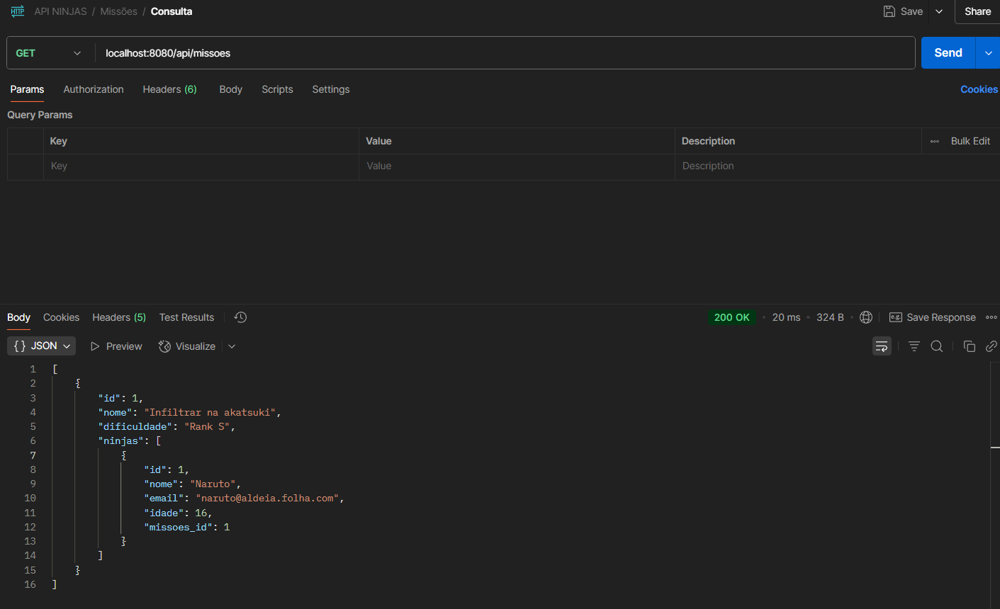

<h1 align="center">⚔️ Spring Boot Ninja API</h1>

<p align="center">
    <i>API RESTful construída com Spring Boot para gerenciamento de Ninjas e Missões.</i><br>
    <b>🚀 Projeto focado em boas práticas, arquitetura limpa e aprendizado profissional.</b>
</p>

---

## 🧠 Visão Geral

Esta API foi criada como parte de um estudo prático para aprender os fundamentos de desenvolvimento backend com Spring Boot. O sistema permite cadastrar **Ninjas**, associá-los a **Missões**, e realizar operações CRUD em ambos.

> 🔄 Relacionamento entre entidades implementado com `@OneToMany` e `@ManyToOne`.

---

## 🧱 Arquitetura

- `Controller` → expõe os endpoints REST
- `Service` → regra de negócio
- `Repository` → interface com banco de dados via Spring Data JPA
- `Model` → entidades do domínio

---

## 🔍 Tecnologias

- Java 17
- Spring Boot
- Spring Data JPA
- Lombok
- MySQL / PostgreSQL (compatível)
- Maven

---

## 📌 Funcionalidades

- [x] Cadastro de Ninja
- [x] Cadastro de Missão
- [x] Relacionamento entre Ninja e Missão
- [x] Endpoints RESTful para GET, POST, PUT, DELETE
- [x] Tratamento de loop recursivo com `@JsonBackReference`

---

## 🗃️ Entidades

### NinjaModel.java
```java
@Entity
@Table(name = "tb_ninjas")
@NoArgsConstructor
@AllArgsConstructor
@Data
public class NinjaModel {
    @Id
    @GeneratedValue(strategy = GenerationType.IDENTITY)
    private Long id;
    private String nome;
    private String email;
    private int idade;

    @ManyToOne
    @JoinColumn(name = "missoes_id")
    @JsonBackReference
    private MissoesModel missoes;
}
````

### MissoesModel.java

```java
@Entity
@Table(name = "tb_missoes")
@NoArgsConstructor
@AllArgsConstructor
@Data
public class MissoesModel {
    @Id
    @GeneratedValue(strategy = GenerationType.IDENTITY)
    private Long id;
    private String nome;
    private String dificuldade;

    @OneToMany(mappedBy = "missoes")
    private List<NinjaModel> ninjas;
}
```

---

## 📸 Prints







---

## 🚀 Como Rodar o Projeto

```bash
# Clone o repositório
git clone https://github.com/seu-usuario/spring-ninja-api.git

# Acesse o projeto
cd spring-ninja-api

# Configure o application.properties com seu banco de dados

# Execute o projeto
./mvnw spring-boot:run
```

---

## 📮 Endpoints

| Método | Endpoint           | Descrição              |
| ------ | ------------------ | ---------------------- |
| GET    | `/api/ninjas`      | Lista todos os ninjas  |
| POST   | `/api/ninjas`      | Cria um ninja          |
| PUT    | `/api/ninjas/{id}` | Atualiza um ninja      |
| DELETE | `/api/ninjas/{id}` | Remove um ninja        |
| GET    | `/api/missoes`     | Lista todas as missões |
| POST   | `/api/missoes`     | Cria uma nova missão   |

---

## 🤝 Contribuições

Esse projeto está em constante evolução para fins de aprendizado. Se quiser contribuir, fique à vontade para abrir issues ou PRs.

---

## 👨‍💻 Autor

Feito por DevGBR

---


